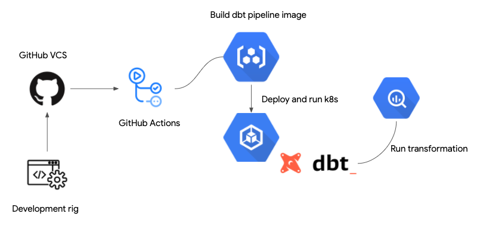

# DataOps CICD Pipeline - dbt + BigQuery + Google Kubernetes Engine + GitHub Actions
Check this  [article on medium](https://medium.com/swlh/dawn-of-dataops-can-we-build-a-100-serverless-etl-following-ci-cd-principles-3ca587ba1ec0) for some background

This example workflow  uses [GitHub Actions][actions] to deploy [a dbt
ETL pipeline](dbtexp/) to an existing [Google Kubernetes Engine][gke] cluster.

## CICD Workflow description

For pushes to the `master` branch, this workflow will:

1.  Download and configure the Google [Cloud SDK][sdk] with the provided
    credentials.

1.  Build, tag, and push a dbt container image to Google Container Registry.

1.  Use a Kubernetes Deployment to push the image to the cluster. It launches a dbt run against BigQuery

